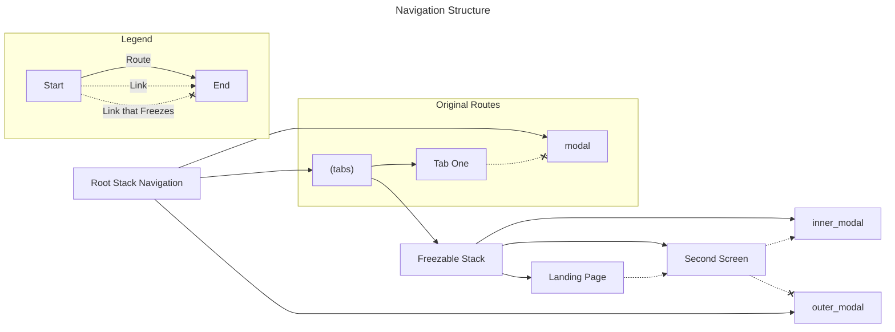

# Expo Router Freezing When Using Gestures

We have an issue where pulling to dismiss a shared modal and then swiping to go back on a stack screen causes a `_UIParallaxDimmingView` to be left on top of
the application preventing user interactions until tabs are switched and switched back.

This issue isn't reproducible if the modal is in the same stack as the stack screen.

## Structure of the Navigation Stack

\* Note: routing from the freezable stack to the original modal will also freeze interactions with the app.  Thus, even in the original routes,
if you were able to swipe to go back after dismissing the modal, you would freeze the interactions.
